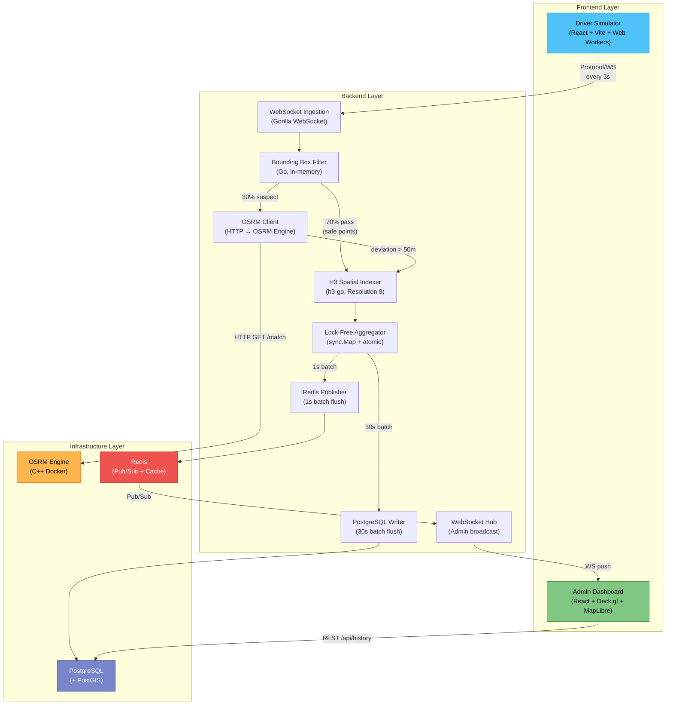
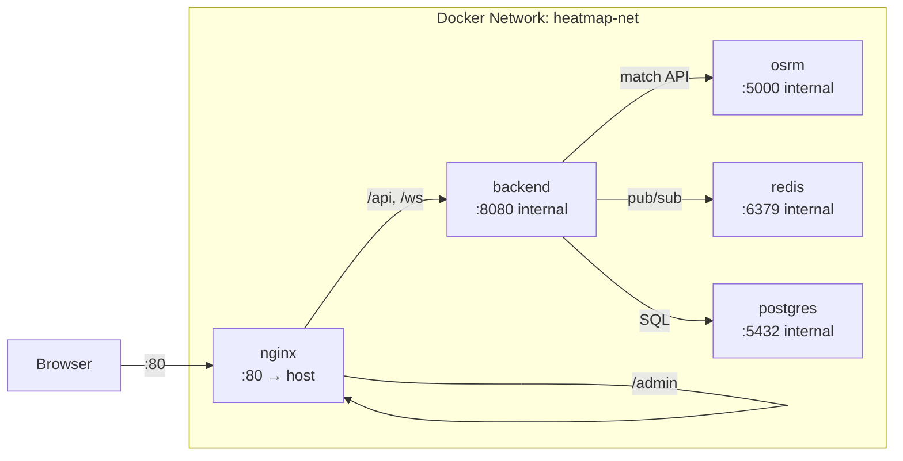

# System Architecture — Real-Time Driver Deviation Heatmap

## 1. High-Level Architecture



## 2. Component Responsibilities

### 2.1 Driver Simulator (Frontend)

| Aspect         | Detail                                                |
| -------------- | ----------------------------------------------------- |
| **Purpose**    | Generate realistic GPS traces for N virtual drivers   |
| **Tech**       | React 18, Vite, Web Workers, protobufjs               |
| **Output**     | Protobuf-encoded `GPSBatch` over WebSocket             |
| **Frequency**  | Every 3 seconds per driver                            |
| **Deviation**  | Configurable X% of drivers intentionally deviate      |

### 2.2 Go Backend

The backend is a **single Go binary** organized into internal packages:

| Package        | Responsibility                                        | I/O              |
| -------------- | ----------------------------------------------------- | ----------------- |
| `ingestion`    | Accept WebSocket connections, decode Protobuf          | WS ← Simulator   |
| `filter`       | Bounding box pre-check + OSRM map-matching             | HTTP → OSRM      |
| `spatial`      | Convert (lat, lng) → H3 cell index                     | Pure computation  |
| `aggregator`   | Lock-free counters per H3 cell                          | In-memory only    |
| `publisher`    | Batch flush aggregated data to Redis                    | TCP → Redis       |
| `persistence`  | Batch insert deviation events to PostgreSQL             | TCP → PostgreSQL  |
| `websocket`    | Admin WebSocket hub, subscribes Redis, pushes clients   | WS → Admin        |

### 2.3 Admin Dashboard (Frontend)

| Aspect         | Detail                                                |
| -------------- | ----------------------------------------------------- |
| **Purpose**    | Visualize deviation heatmap in real-time              |
| **Tech**       | React 18, Deck.gl (H3HexagonLayer), MapLibre GL JS    |
| **Input**      | WebSocket stream of `HeatmapUpdate` messages           |
| **Features**   | 3D hexagon heatmap, time range filter, history query   |

## 3. Data Pipeline Stages

```
Stage 1         Stage 2           Stage 3          Stage 4         Stage 5
GPS Point  ──► BBox Check   ──► OSRM Match   ──► H3 Index   ──► Atomic Add
(lat,lng)      (in-memory)      (HTTP, 50ms)     (O(1))         (sync.Map)
               ~0.001ms         ~5-50ms          ~0.001ms       ~0.001ms

                                                                    │
                                                          ┌─────────┤
                                                          │         │
                                                     Stage 6    Stage 7
                                                     Redis      PostgreSQL
                                                     Pub/Sub    Batch Insert
                                                     (1s cycle) (30s cycle)
                                                     ~1ms       ~5ms
```

**Total hot-path latency budget:** < 100ms per GPS point (excluding PostgreSQL batch).

## 4. Resource Allocation (4GB VPS)

```
┌──────────────────────────────────────────────────────────────────┐
│                    TOTAL RAM: 4.0 GB                            │
├──────────────────────┬───────────┬───────────────────────────────┤
│ Component            │ Limit     │ Notes                         │
├──────────────────────┼───────────┼───────────────────────────────┤
│ Ubuntu 22.04 OS      │ ~500 MB   │ Kernel, systemd, SSH          │
│ PostgreSQL + PostGIS │  800 MB   │ shared_buffers=256MB          │
│ OSRM Engine (C++)    │  400 MB   │ Vietnam map MLD graph         │
│ Redis                │  200 MB   │ maxmemory 200mb               │
│ Go Backend           │   40 MB   │ GOGC=100, soft limit          │
│ Nginx + Static Files │   20 MB   │ Compiled React assets         │
├──────────────────────┼───────────┼───────────────────────────────┤
│ BUFFER (OS + Burst)  │ >2.0 GB   │ Swap not recommended          │
└──────────────────────┴───────────┴───────────────────────────────┘
```

## 5. Network Topology (Docker)



Only port **80** (Nginx) is exposed to the host. All other services communicate over the internal Docker network.

## 6. Scalability Notes

This architecture is designed for a **demo on a single VPS**. For production scaling:

| Bottleneck          | Scaling Strategy                                     |
| ------------------- | ---------------------------------------------------- |
| Go Backend CPU      | Horizontal: run multiple instances behind load balancer |
| OSRM Memory         | Vertical: larger VM, or split by region              |
| Redis               | Redis Cluster or Redis Sentinel                       |
| PostgreSQL          | Read replicas, TimescaleDB for time-series            |
| WebSocket clients   | Sticky sessions + multiple WebSocket hubs             |
