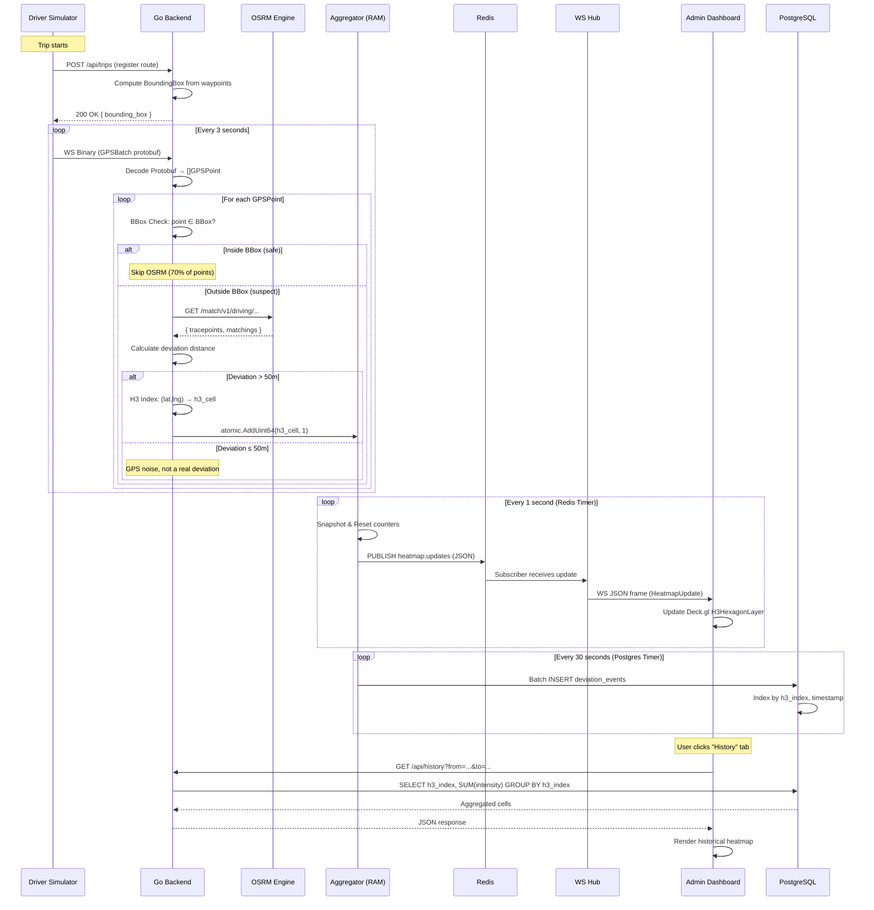

# Data Flow — Real-Time Driver Deviation Heatmap

> End-to-end data flow from GPS generation to heatmap visualization.

---

## 1. Complete Data Flow Sequence



---

## 2. Data Transformations at Each Stage

### Stage 1: Simulator → Backend (WebSocket Binary)

```
Browser (Web Worker)
    → Protobuf encode: GPSBatch { points: [GPSPoint, GPSPoint, ...] }
    → WebSocket.send(binary_frame)
    → ~50 bytes per GPSPoint (vs ~200 bytes JSON)
    → ~500 bytes per batch (10 drivers per worker)
```

### Stage 2: Backend Ingestion

```
Binary frame received
    → proto.Unmarshal(data, &GPSBatch{})
    → Iterate points, lookup trip BoundingBox by driver_id
    → Dispatch to filter pipeline
```

### Stage 3: Filter Pipeline

```
GPSPoint {lat: 10.7821, lng: 106.7089}

Step A: BBox Check
    trip_bbox = {min_lat: 10.77, min_lng: 106.69, max_lat: 10.80, max_lng: 106.72}
    10.7821 ∈ [10.77, 10.80] → YES
    106.7089 ∈ [106.69, 106.72] → YES
    → Point is INSIDE bbox → Skip OSRM ✓

    OR if point is OUTSIDE bbox:

Step B: OSRM Match
    Request:  GET /match/v1/driving/106.7089,10.7821;106.7050,10.7800
    Response: { tracepoints: [{ location: [106.7085, 10.7819] }] }
    
Step C: Deviation Calculation
    matched_point = (10.7819, 106.7085)
    planned_distance = MinDistanceToPolyline(matched_point, planned_route)
    = 120.5 meters
    → 120.5 > 50m threshold → DEVIATION DETECTED ✓
```

### Stage 4: H3 Indexing

```
Deviation point: (10.7821, 106.7089)
    → h3.LatLngToCell(h3.NewLatLng(10.7821, 106.7089), 8)
    → "882830828bfffff"
```

### Stage 5: Aggregation

```
Lock-free map state before:
    "882830828bfffff" → 14

atomic.AddUint64(counter, 1)

Lock-free map state after:
    "882830828bfffff" → 15
```

### Stage 6: Redis Publish (1s batch)

```json
{
    "cells": [
        {"h3_index": "882830828bfffff", "intensity": 15, "last_updated": 1722744001000},
        {"h3_index": "8828308283fffff", "intensity": 3, "last_updated": 1722744000500}
    ],
    "server_timestamp": 1722744001000,
    "total_drivers": 500,
    "total_deviations": 42
}
```

### Stage 7: PostgreSQL Batch Insert (30s batch)

```sql
INSERT INTO deviation_events (driver_id, trip_id, latitude, longitude, h3_index, deviation_meters, created_at)
VALUES
    ('d-001', 'trip-abc', 10.7821, 106.7089, '882830828bfffff', 120.5, '2024-08-04T12:00:01Z'),
    ('d-042', 'trip-xyz', 10.7900, 106.7150, '8828308283fffff', 85.2, '2024-08-04T12:00:02Z'),
    ...
ON CONFLICT DO NOTHING;
```

---

## 3. Error Handling at Each Stage

| Stage          | Error Scenario                    | Handling                                    |
| -------------- | --------------------------------- | ------------------------------------------- |
| WS Ingestion   | Client disconnects                | Log, remove driver from active map          |
| WS Ingestion   | Invalid Protobuf data             | Log error, drop message, continue           |
| BBox Check     | Trip not found for driver_id      | Log warning, skip point                     |
| OSRM Match     | OSRM timeout (>500ms)            | Log timeout, skip point, increment counter  |
| OSRM Match     | OSRM returns no matchings         | Treat as potential deviation, log            |
| H3 Indexing    | Invalid lat/lng (NaN, out of range)| Skip point, log error                      |
| Redis Publish  | Redis connection lost             | Buffer in memory, retry on reconnect        |
| PG Batch       | PostgreSQL connection lost        | Buffer events, retry with backoff           |
| WS Hub         | Admin client disconnects          | Remove from broadcast list, continue        |

---

## 4. Data Volume Estimates

### For 1,000 concurrent drivers:

| Metric                        | Value        | Calculation                          |
| ----------------------------- | ------------ | ------------------------------------ |
| GPS points per second         | ~333         | 1000 drivers ÷ 3s interval          |
| Suspect points (30%)          | ~100/s       | 333 × 0.30                          |
| OSRM calls per second         | ~100/s       | Only suspect points                  |
| Confirmed deviations (~10%)   | ~10/s        | 100 × 0.10                          |
| H3 cells updated per second   | ~5-10        | Deviations clustered in areas        |
| Redis messages per second     | 1            | Batched every 1s                     |
| WS messages to admin per sec  | 1            | Same as Redis                        |
| PG inserts per 30 seconds     | ~300         | 10/s × 30s                          |
| Network: Simulator → Backend  | ~16 KB/s     | 333 × 50 bytes                      |
| Network: Backend → Admin      | ~1 KB/s      | 1 JSON message × ~1 KB              |
