# Tài Liệu Thiết Kế Phần Mềm (SDD)
## Heat Map Pro — Hệ Thống Heatmap Theo Dõi Độ Lệch Tài Xế Thời Gian Thực

| Thông tin | Chi tiết |
|---|---|
| **Phiên bản** | 1.0.0 |
| **Ngày tạo** | 10/08/2026 |
| **Trạng thái** | Chính thức |

---

## Mục Lục

1. [Kiến Trúc Tổng Quan](#1-kiến-trúc-tổng-quan)
2. [Thiết Kế Module — Go Backend](#2-thiết-kế-module--go-backend)
3. [Luồng Dữ Liệu](#3-luồng-dữ-liệu)
4. [Kiến Trúc Frontend](#4-kiến-trúc-frontend)
5. [Thiết Kế AI Agent](#5-thiết-kế-ai-agent)
6. [Thiết Kế Cơ Sở Dữ Liệu](#6-thiết-kế-cơ-sở-dữ-liệu)
7. [Hợp Đồng API](#7-hợp-đồng-api)
8. [Mô Hình Đồng Thời](#8-mô-hình-đồng-thời)
9. [Hạ Tầng & Triển Khai](#9-hạ-tầng--triển-khai)
10. [Thiết Kế Bảo Mật](#10-thiết-kế-bảo-mật)
11. [Quản Lý Cấu Hình](#11-quản-lý-cấu-hình)

---

## 1. Kiến Trúc Tổng Quan

### 1.1 Sơ Đồ Kiến Trúc Hệ Thống

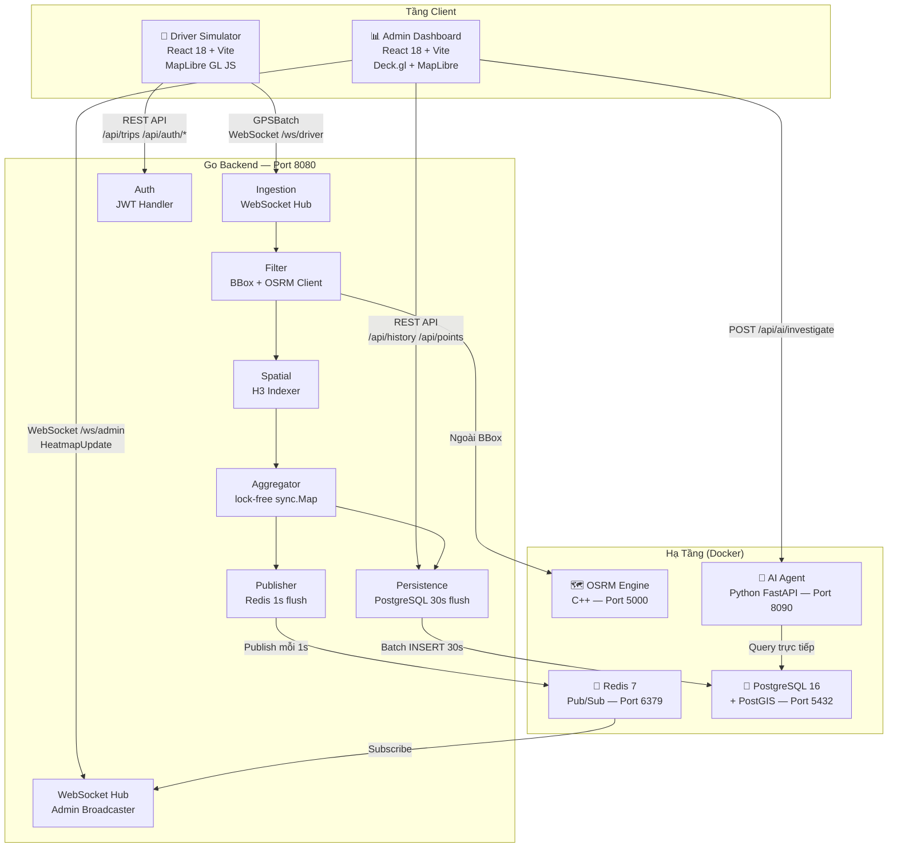

### 1.2 Các Quyết Định Kiến Trúc

| Quyết Định | Lựa Chọn | Lý Do |
|---|---|---|
| **Ngôn ngữ Backend** | Go 1.22 | Đồng thời cao, footprint bộ nhớ thấp, goroutine native cho streaming |
| **Map-matching** | OSRM | Mã nguồn mở, chạy local (không tốn phí API), timeout 500ms chấp nhận được |
| **Chỉ mục không gian (Backend)** | **Grid-based indexer thuần Go** | `uber/h3-go` yêu cầu CGO (cần C compiler), không có trên máy dev. Thay bằng grid thuần Go mô phỏng H3 Resolution 8, ô ~460m, format index `H8:latGrid:lngGrid`. Trong production nên đổi sang `h3-go`. |
| **Chỉ mục không gian (Frontend)** | `h3-js` — **zoom-adaptive** (Res 9–14) | 3D H3 Hexagon Grid tự điều chỉnh resolution theo zoom level: Res 9 (~174m) khi toàn cảnh → Res 14 (~1m) khi zoom sâu nhất (MAX). Debounce 300ms, tối đa 6 lần re-compute. Dedup waypoint OSRM dùng Res 11 (cố định). |
| **Vận chuyển thời gian thực** | Redis Pub/Sub | Tách rời ingestion và broadcasting; hỗ trợ fan-out tới nhiều admin client |
| **Lưu trữ lịch sử** | PostgreSQL + PostGIS | Tuân thủ ACID, hỗ trợ truy vấn không gian phong phú |
| **Render heatmap** | Deck.gl H3HexagonLayer | Hỗ trợ H3 native, tăng tốc WebGL, hỗ trợ >100k hexagon |
| **Mẫu AI** | ReAct (Reason-Act) | Cho phép gọi công cụ có điều kiện, dựa trên bằng chứng, không có quy trình cố định |

---

## 2. Thiết Kế Module — Go Backend

### 2.1 Cấu Trúc Package

```
backend/
├── cmd/server/
│   └── main.go              # Điểm vào: wiring phụ thuộc, routing HTTP, graceful shutdown
├── internal/
│   ├── config/
│   │   └── config.go        # Đọc và validate biến môi trường. Trả về *Config.
│   ├── ingestion/
│   │   └── handler.go       # WebSocket handler + đường ống 6 giai đoạn phát hiện lệch
│   ├── filter/
│   │   ├── bounding_box.go  # Kiểm tra BBox trong bộ nhớ với buffer 50m
│   │   └── osrm_client.go   # HTTP client OSRM (Match + Nearest API)
│   ├── spatial/
│   │   └── h3_indexer.go    # Grid-based indexer thuần Go (không CGO). Ô ~460m, format H8:lat:lng
│   ├── aggregator/
│   │   └── lockfree.go      # sync.Map + atomic.AddUint64 bản đồ bộ đếm
│   ├── publisher/
│   │   └── redis_pub.go     # Publish Redis + vòng lặp flush 1s
│   ├── persistence/
│   │   └── postgres.go      # Pool PostgreSQL + REST handlers + batch write 30s
│   ├── websocket/
│   │   └── hub.go           # Admin WebSocket hub + Redis subscriber
│   └── auth/
│       ├── repository.go    # Truy vấn DB cho tài khoản tài xế
│       └── handler.go       # HTTP handlers: Register / Login / Me
├── gen/heatmap/v1/          # Code Go sinh ra từ Protobuf (KHÔNG CHỈNH SỬA)
└── proto/heatmap/v1/
    └── messages.proto       # Nguồn chân lý cho tất cả schema tin nhắn
```

### 2.2 Hợp Đồng Interface (Đảo Ngược Phụ Thuộc)

Mỗi interface được định nghĩa trong **package tiêu thụ**, không phải package cung cấp:

```go
// ingestion/handler.go — tất cả interface mà handler cần:

type Filter interface {
    IsInsideBBox(lat, lng float64, tripID string) bool
    RegisterTrip(tripID string, waypoints []Waypoint) BoundingBox
}

type MapMatcher interface {
    MatchAndDistance(ctx context.Context, lat, lng float64,
                     tripWaypoints []Waypoint) (float64, error)
}

type SpatialIndexer interface {
    LatLngToCell(lat, lng float64) string
}

type DeviationAggregator interface {
    Increment(h3Index string)
}

type EventPersister interface {
    BufferEvent(event DeviationEventData)
}
```

### 2.3 Đường Ống Phát Hiện Lệch Lộ Trình (6 Giai Đoạn)

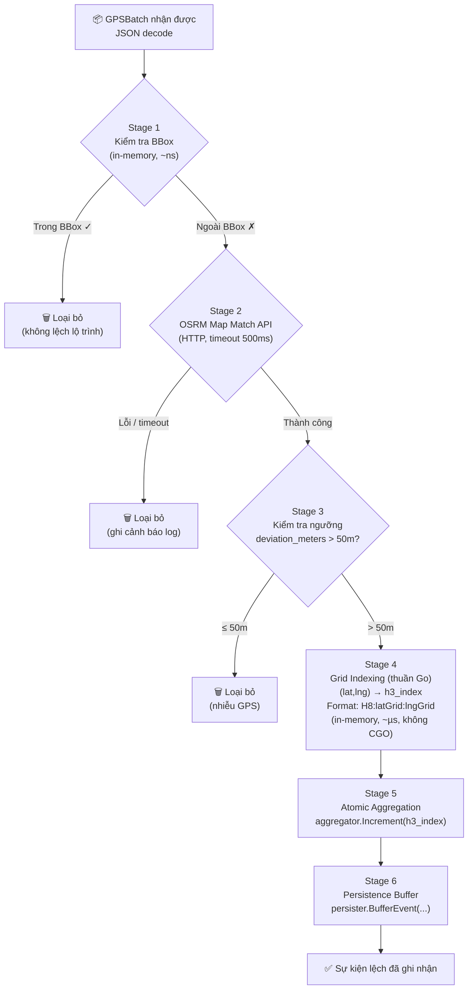

### 2.4 Quy Tắc Import (Kiến Trúc Phân Lớp)

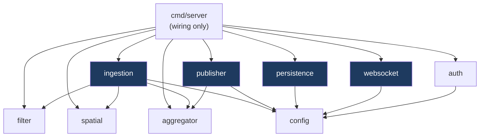

> ⚠️ **Quy tắc cấm:** `ingestion` KHÔNG được import `publisher`, `persistence`, `websocket`. `publisher` KHÔNG được import `ingestion`, `filter`.

---

## 3. Luồng Dữ Liệu

### 3.1 Luồng Nhận GPS Thời Gian Thực

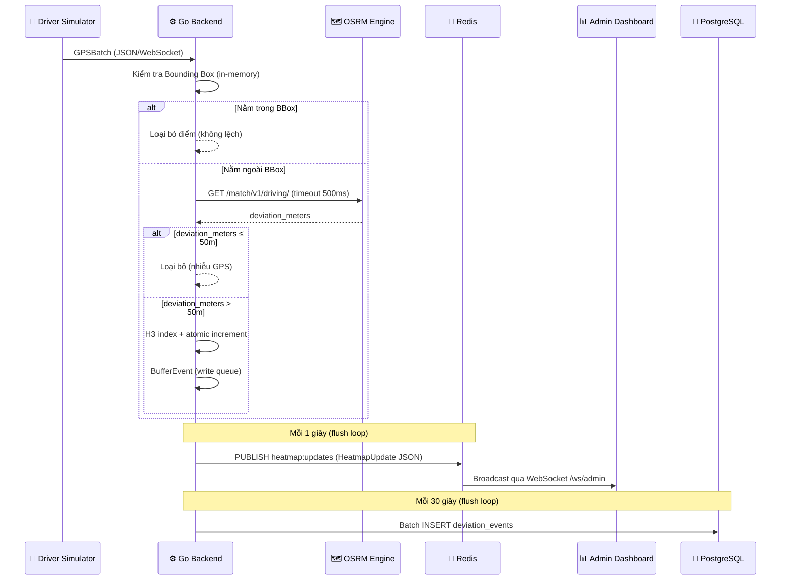

### 3.2 Luồng Truy Vấn Dữ Liệu Lịch Sử

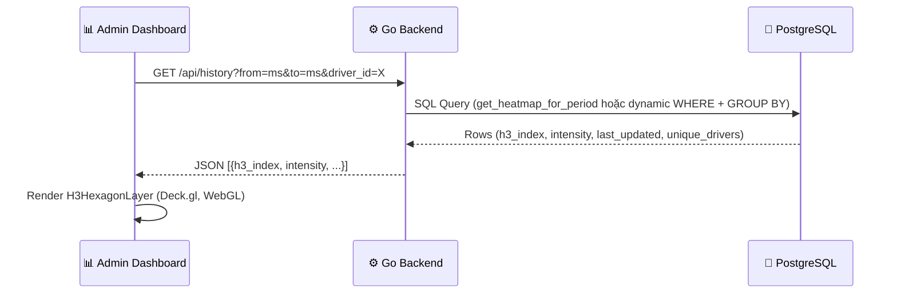

### 3.3 Luồng Điều Tra AI

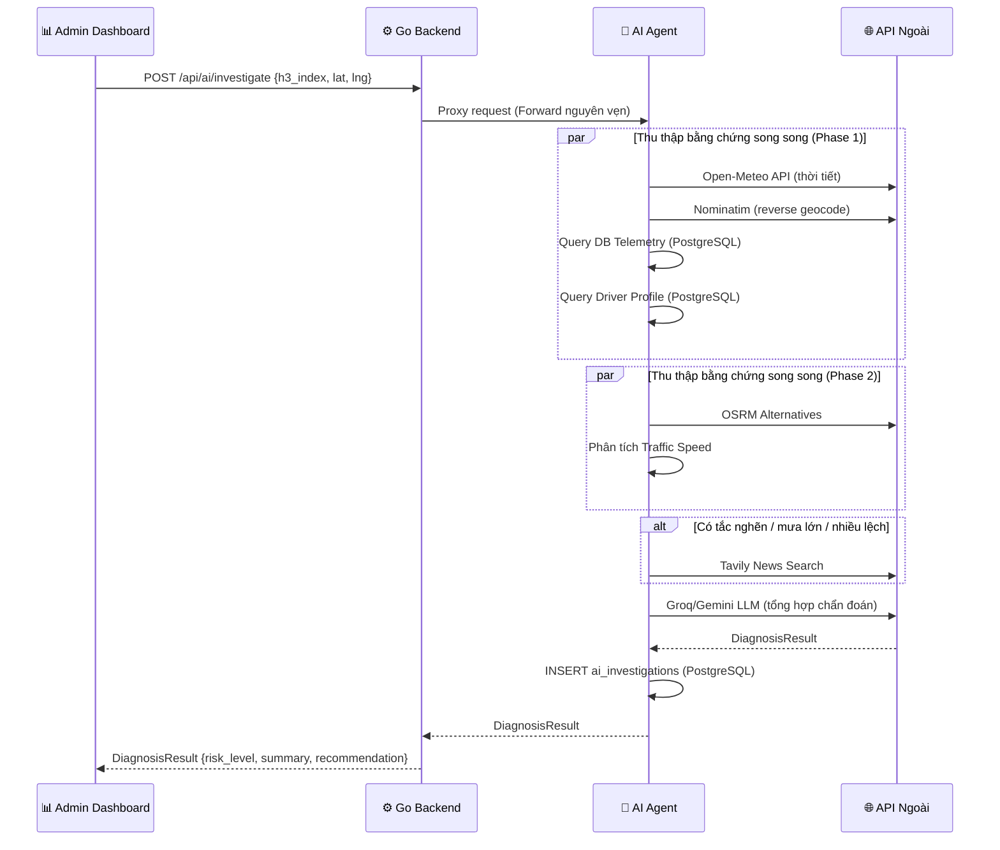

---

## 4. Kiến Trúc Frontend

### 4.1 Driver Simulator

**Entry point:** `frontend/simulator/src/App.jsx`

> 📌 **Lưu ý:** Driver Simulator không dùng H3 để phát hiện lệch. H3 chỉ được dùng ở Admin Dashboard (`h3-js` Resolution 11) để dedup GPS waypoint trước khi gửi vào OSRM.

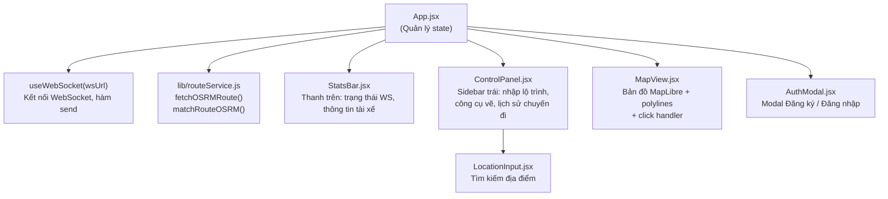

**Các biến trạng thái chính:**

| Biến State | Kiểu | Mô Tả |
|---|---|---|
| `driver` | Object | Hồ sơ tài xế đã đăng nhập (lưu trong localStorage) |
| `token` | String | JWT token xác thực (lưu trong localStorage) |
| `origin` / `destination` | Object | `{lat, lng, label}` điểm đi / điểm đến |
| `plannedRouteCoords` | `[lng, lat][]` | Lộ trình kế hoạch tối ưu từ OSRM |
| `actualRouteCoords` | `[lng, lat][]` | Lộ trình thực tế do tài xế vẽ / OSRM snapped |
| `isDrawMode` | Boolean | Khi true: nhấp bản đồ thêm điểm waypoint |
| `reviewingTrip` | Object \| null | Chuyến đi đang replay (khóa mọi tương tác chỉnh sửa) |

### 4.2 Admin Dashboard

**Entry point:** `frontend/admin/src/App.jsx`

> 📌 **Lưu ý về H3 trong Admin Frontend:**
> - `h3-js` **zoom-adaptive Res 9–14**: 3D Hexagon Grid tự điều chỉnh resolution theo bảng sau:
>
> | Zoom | Resolution | Ô | Mức dùng |
> |---|---|---|---|
> | < 10 | 9 | ~174m | Toàn thành phố |
> | 10–11 | 10 | ~66m | Quận / khu vực |
> | 12–13 | 11 | ~25m | Đường phố |
> | 14–15 | 12 | ~9m | Ngã tư |
> | 16–17 | 13 | ~3m | Làn xe |
> | ≥ 18 | **14 (MAX)** | ~1m | Chi tiết nhất |
>
> - Debounce 300ms, chỉ re-compute khi zoom vượt ngưỡng tier (tối đa 6 lần)
> - `h3-js` **Res 11** (~25m): Dedup GPS waypoint trong `gpsToH3Waypoints()` trước OSRM (cố định)
> - `h3-js` **Res 10** (~65m): So sánh % trùng lập trong `computeH3Overlap()` (cố định)
> - Ô lưới heatmap từ backend: format `H8:latGrid:lngGrid` (grid thuần Go, ~460m)

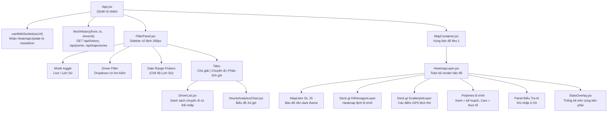

**Các biến trạng thái chính:**

| Biến State | Kiểu | Mô Tả |
|---|---|---|
| `mode` | `'live' \| 'history'` | Chế độ hiển thị của dashboard |
| `h3Cells` | Map | Ô H3 trực tiếp từ luồng WebSocket |
| `historyHexagons` | Array | Ô H3 lịch sử từ REST API |
| `historyTrips` | Array | Bản ghi chuyến đi cho danh sách |
| `selectedDriverId` | String \| null | Bộ lọc tài xế đang hoạt động |
| `selectedTrip` | Object \| null | Chuyến đi đang hiển thị trên bản đồ |
| `connectionStatus` | String | `connecting` / `connected` / `disconnected` |

### 4.3 Hook Dùng Chung: `useWebSocket`

Đặt tại `hooks/useWebSocket.js` trong mỗi ứng dụng (độc lập, không cross-import).

**Hành vi:**
- Tạo kết nối WebSocket tới URL được cung cấp.
- Triển khai exponential-backoff reconnection khi mất kết nối.
- Cung cấp `{ connectionStatus, send, lastMessage }`.
- Dọn dẹp khi component unmount.

---

## 5. Thiết Kế AI Agent

### 5.1 Kiến Trúc Agent

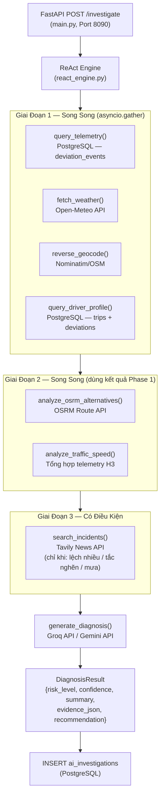

### 5.2 Danh Sách Công Cụ

| File | Công Cụ | Phụ Thuộc Ngoài |
|---|---|---|
| `tools/weather.py` | Lấy dữ liệu mưa, gió, nhiệt độ thời gian thực | Open-Meteo API (miễn phí) |
| `tools/reverse_geocode.py` | Chuyển tọa độ thành địa chỉ đọc được | Nominatim (OSM) |
| `tools/news_search.py` | Tìm kiếm sự cố giao thông/tin tức khu vực | Tavily API |
| `tools/db_telemetry.py` | Truy vấn thống kê lệch từ PostgreSQL | PostgreSQL nội bộ |
| `tools/driver_profile.py` | Tính danh tiếng và lịch sử lệch của tài xế | PostgreSQL nội bộ |
| `tools/osrm_alternatives.py` | Phân tích lộ trình thay thế để giải thích vòng vèo | OSRM Route API |
| `tools/traffic_speed_ratio.py` | So sánh tốc độ tài xế với tốc độ điển hình | Tổng hợp telemetry H3 |
| `llm_client.py` | Tạo chẩn đoán cuối cùng có căn cứ | Groq API / Gemini API |

---

## 6. Thiết Kế Cơ Sở Dữ Liệu

### 6.1 Chiến Lược Index

| Tên Index | Bảng | Cột | Mục Đích |
|---|---|---|---|
| `idx_deviation_events_created_at` | `deviation_events` | `created_at DESC` | Truy vấn theo khoảng thời gian (phổ biến nhất) |
| `idx_deviation_events_h3_index` | `deviation_events` | `h3_index` | Tổng hợp theo ô H3 |
| `idx_deviation_events_driver_id` | `deviation_events` | `(driver_id, created_at DESC)` | Truy vấn thời gian theo tài xế |
| `idx_deviation_events_h3_time` | `deviation_events` | `(h3_index, created_at DESC)` | Truy vấn kết hợp ô + thời gian |
| `idx_deviation_driver_created` | `deviation_events` | `(driver_id, created_at) INCLUDE(...)` | Truy vấn danh tiếng tài xế 30 ngày |
| `idx_deviation_h3_created` | `deviation_events` | `(h3_index, created_at) INCLUDE(...)` | Truy vấn tuân thủ ô |
| `idx_trips_driver_id` | `trips` | `driver_id` | Tra cứu chuyến đi theo tài xế |
| `idx_trips_status` | `trips` | `status WHERE status='active'` | Partial index cho chuyến đi đang hoạt động |
| `idx_drivers_email` | `drivers` | `email` | Tra cứu khi đăng nhập |
| `idx_drivers_driver_id` | `drivers` | `driver_id` | Tra cứu hồ sơ |
| `idx_ai_investigations_h3` | `ai_investigations` | `(h3_index, created_at DESC)` | Lịch sử điều tra AI |

### 6.2 View và Function SQL

```sql
-- View tổng hợp sẵn cho truy vấn dashboard
CREATE OR REPLACE VIEW heatmap_summary AS
SELECT
    h3_index,
    COUNT(*)::INTEGER          AS intensity,
    MAX(created_at)            AS last_updated,
    COUNT(DISTINCT driver_id)  AS unique_drivers
FROM deviation_events
GROUP BY h3_index;

-- Function được gọi bởi GET /api/history (không có filter driver)
CREATE OR REPLACE FUNCTION get_heatmap_for_period(p_from TIMESTAMPTZ, p_to TIMESTAMPTZ)
RETURNS TABLE (h3_index VARCHAR(20), intensity INTEGER,
               last_updated TIMESTAMPTZ, unique_drivers INTEGER)
-- Khi có filter driver_id, dùng dynamic WHERE clause:
-- WHERE created_at >= $1 AND created_at <= $2 AND driver_id = $3
-- GROUP BY h3_index ORDER BY intensity DESC
```

---

## 7. Hợp Đồng API

### 7.1 Tin Nhắn WebSocket

#### `ws://backend/ws/driver` — Simulator → Backend

```json
{
  "points": [
    {
      "driver_id": "DRV-17F56574",
      "trip_id": "TRIP-ABC1234",
      "latitude": 10.8184,
      "longitude": 106.6588,
      "timestamp": 1723264000000,
      "heading": 90.0,
      "speed": 40.0
    }
  ]
}
```

#### `ws://backend/ws/admin` — Backend → Admin

```json
{
  "cells": [
    {
      "h3_index": "882830828bfffff",
      "intensity": 12,
      "last_updated": 1723264001000
    }
  ],
  "server_timestamp": 1723264001000,
  "total_drivers": 5,
  "total_deviations": 127
}
```

### 7.2 REST Endpoint Chi Tiết

#### `GET /api/history`

**Tham số truy vấn:**

| Tham Số | Kiểu | Bắt Buộc | Mô Tả |
|---|---|---|---|
| `from` | int64 (unix ms) | Không | Thời điểm bắt đầu |
| `to` | int64 (unix ms) | Không | Thời điểm kết thúc |
| `driver_id` | string | Không | Lọc theo tài xế cụ thể |

**Response:**
```json
{
  "hexagons": [
    {
      "h3_index": "882830828bfffff",
      "intensity": 42,
      "last_updated": "2026-08-10T03:00:00Z",
      "unique_drivers": 3
    }
  ],
  "from_ms": 1723200000000,
  "to_ms": 1723264000000
}
```

#### `POST /api/trips`

**Request Body:**
```json
{
  "trip_id": "TRIP-ABC1234",
  "driver_id": "DRV-17F56574",
  "driver_name": "Nguyễn Văn A",
  "origin": { "lat": 10.8184, "lng": 106.6588, "label": "Sân bay Tân Sơn Nhất" },
  "destination": { "lat": 10.7725, "lng": 106.6980, "label": "Chợ Bến Thành" },
  "waypoints": [[106.6588, 10.8184], [106.6980, 10.7725]],
  "actual_route": [[106.6588, 10.8184], [106.71, 10.79], [106.6980, 10.7725]],
  "distance_km": 8.2,
  "duration_min": 25,
  "is_deviated": true
}
```

#### `POST /api/ai/investigate`

**Request Body:**
```json
{
  "h3_index": "882830828bfffff",
  "lat": 10.8184,
  "lng": 106.6588,
  "driver_id": "DRV-17F56574",
  "timestamp_ms": 1723264000000,
  "time_window_minutes": 30
}
```

**Response:**
```json
{
  "risk_level": "HIGH",
  "confidence": 0.87,
  "summary": "Phát hiện lệch lộ trình đáng kể tại khu vực này do ngập lụt trên đường Nguyễn Văn Trỗi, kết hợp với tai nạn 3 xe được báo cáo lúc 14:30. 12 trong 18 tài xế trong ô H3 này đã chọn lộ trình thay thế qua đường Cộng Hòa.",
  "evidence_json": { "weather": {}, "news": [], "fleet_telemetry": {} },
  "recommendation": "Đề xuất tạm thời quy hoạch lại lộ trình qua đường Trường Sơn. Cảnh báo tài xế chủ động.",
  "location_name": "Nguyễn Văn Trỗi, Phú Nhuận, TP.HCM"
}
```

---

## 8. Mô Hình Đồng Thời

### 8.1 Goroutines Backend Go

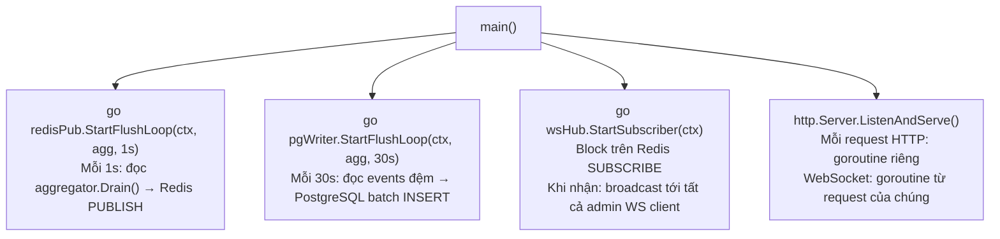

### 8.2 Thiết Kế Aggregator Lock-Free

```go
// aggregator/lockfree.go
type Aggregator struct {
    cells sync.Map  // map[h3_index string] → *uint64
}

func (a *Aggregator) Increment(h3Index string) {
    val, _ := a.cells.LoadOrStore(h3Index, new(uint64))
    atomic.AddUint64(val.(*uint64), 1)
}
```

**Tại sao không dùng mutex?** Aggregator nhận hàng trăm lần increment mỗi giây từ các goroutine đồng thời (một goroutine cho mỗi kết nối WebSocket tài xế). Dùng `sync.Mutex` sẽ tạo điểm nghẽn. `sync.Map` + `atomic.AddUint64` đảm bảo thread-safety mà không khóa toàn bộ map.

### 8.3 Ngăn Chặn Race Condition

| Thành Phần | Cơ Chế |
|---|---|
| **Theo dõi tài xế đang hoạt động** | `sync.RWMutex` (đọc nhiều, ghi ít) |
| **Buffer write (persistence)** | Slice được bảo vệ bởi mutex; flush và hoán đổi atomic |
| **Redis publisher** | Một goroutine duy nhất sở hữu vòng lặp flush; không write đồng thời |
| **Admin hub clients** | Map client được bảo vệ bởi `sync.RWMutex` |

---

## 9. Hạ Tầng & Triển Khai

### 9.1 Dịch Vụ Docker Compose

| Dịch Vụ | Image | Port | RAM | CPU |
|---|---|---|---|---|
| `postgres` | `postgis/postgis:16-3.4-alpine` | 5432 | 800M | 0.5 |
| `redis` | `redis:7-alpine` | 6379 | 200M | 0.25 |
| `osrm` | `osrm/osrm-backend:latest` | 5000 | 400M | 1.0 |
| `backend` | Custom Go Docker | 8080 | 100M | 0.5 |
| `ai-agent` | Custom Python FastAPI | 8090 | 150M | 0.5 |
| `nginx` | `nginx:alpine` | 80 | 50M | 0.25 |
| **Tổng cộng** | | | **~1.7GB** | **~3.0** |

### 9.2 Thứ Tự Khởi Động Dịch Vụ

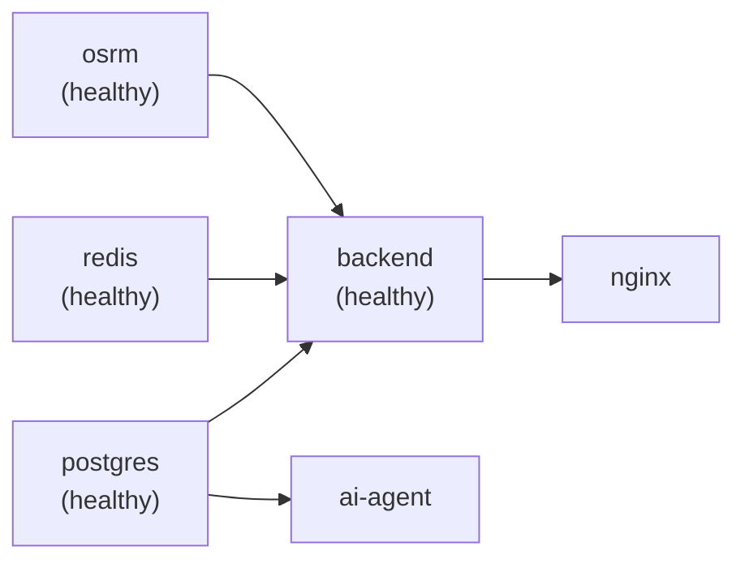

### 9.3 Khởi Động Phát Triển (Local)

```bash
# Một lệnh khởi động toàn bộ hệ thống:
npm run start

# Lệnh này tự động chạy:
# prestart: docker compose up -d postgres redis ai-agent
# start:backend: go build -o server.exe && ./server.exe  (Port 8080)
# start:admin: cd frontend/admin && npm run dev           (Vite :5173)
# start:simulator: cd frontend/simulator && npm run dev  (Vite :5174)
```

> **Lưu ý (Windows):** Dùng `go build -o server.exe` thay vì `go run` do chính sách Windows AppLocker có thể chặn các tệp thực thi tạm thời.

### 9.4 Nginx Reverse Proxy (Production)

Nginx đóng vai trò điểm vào duy nhất (Port 80):

| Route | Đích |
|---|---|
| `/api/*` | Go Backend (Port 8080) |
| `/ws/*` | Go Backend WebSocket (Port 8080) |
| `/` | Admin Dashboard (static files) |
| `/simulator` | Driver Simulator (static files) |

---

## 10. Thiết Kế Bảo Mật

### 10.1 Luồng Xác Thực

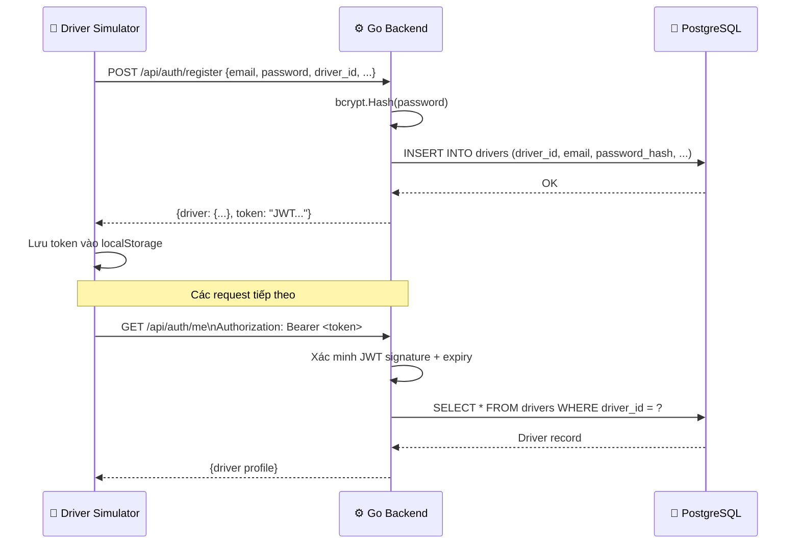

### 10.2 Các Biện Pháp Bảo Mật

| Biện Pháp | Cách Triển Khai |
|---|---|
| **Băm mật khẩu** | bcrypt trong `auth/repository.go` |
| **Quản lý bí mật** | Tất cả thông tin xác thực qua biến môi trường (`.env`) |
| **Không hardcode** | Được thực thi bởi quy tắc kiến trúc trong `AGENTS.md` |
| **CORS** | Wildcard `*` trong development; cần giới hạn trong production |
| **WebSocket Origin** | `CheckOrigin: return true` trong development; cần validate trong production |
| **Cô lập mạng** | OSRM nằm trong Docker bridge network `heatmap-net`, không expose ra ngoài |
| **Bảo mật Git** | `.gitignore` loại trừ `.env`, `*.osm.pbf`, `*.osrm*` |

---

## 11. Quản Lý Cấu Hình

### 11.1 Tham Chiếu Biến Môi Trường

| Biến | Giá Trị Mặc Định | Mô Tả |
|---|---|---|
| `APP_ENV` | `development` | Môi trường ứng dụng |
| `LOG_LEVEL` | `debug` | Mức độ log (debug/info/warn/error) |
| `BACKEND_PORT` | `8080` | Cổng HTTP của Go backend |
| `OSRM_URL` | `http://127.0.0.1:5000` | URL cơ sở của OSRM engine |
| `OSRM_MATCH_TIMEOUT_MS` | `500` | Timeout OSRM map match (ms) |
| `REDIS_ADDR` | `127.0.0.1:6379` | Địa chỉ kết nối Redis |
| `REDIS_CHANNEL` | `heatmap:updates` | Tên kênh Redis Pub/Sub |
| `POSTGRES_HOST` | `127.0.0.1` | Host PostgreSQL |
| `POSTGRES_DB` | `heatmap_db` | Tên database PostgreSQL |
| `POSTGRES_USER` | `heatmap` | Tên người dùng PostgreSQL |
| `POSTGRES_PASSWORD` | *(bắt buộc)* | Mật khẩu PostgreSQL |
| `H3_RESOLUTION` | `8` | Resolution của grid indexer (0–15). Resolution 8 ≈ 460m/ô. **Chú ý:** Backend dùng grid thuần Go mô phỏng H3, không dùng thư viện h3-go (cần CGO). |
| `FLUSH_INTERVAL_REDIS_MS` | `1000` | Chu kỳ flush Redis (ms) |
| `FLUSH_INTERVAL_POSTGRES_S` | `30` | Chu kỳ ghi batch PostgreSQL (giây) |
| `BBOX_BUFFER_METERS` | `50` | Độ rộng buffer BBox (mét) |
| `DEVIATION_THRESHOLD_METERS` | `50` | Ngưỡng tối thiểu để xác nhận lệch (mét) |
| `AI_AGENT_URL` | `http://localhost:8090` | URL dịch vụ AI Agent |
| `GROQ_API_KEY` | *(tùy chọn)* | API key Groq LLM |
| `GEMINI_API_KEY` | *(tùy chọn)* | API key Google Gemini |
| `VITE_WS_URL` | `ws://localhost:8080/ws/driver` | URL WebSocket frontend (build-time) |
| `VITE_API_URL` | `http://localhost:8080` | URL REST API frontend (build-time) |
