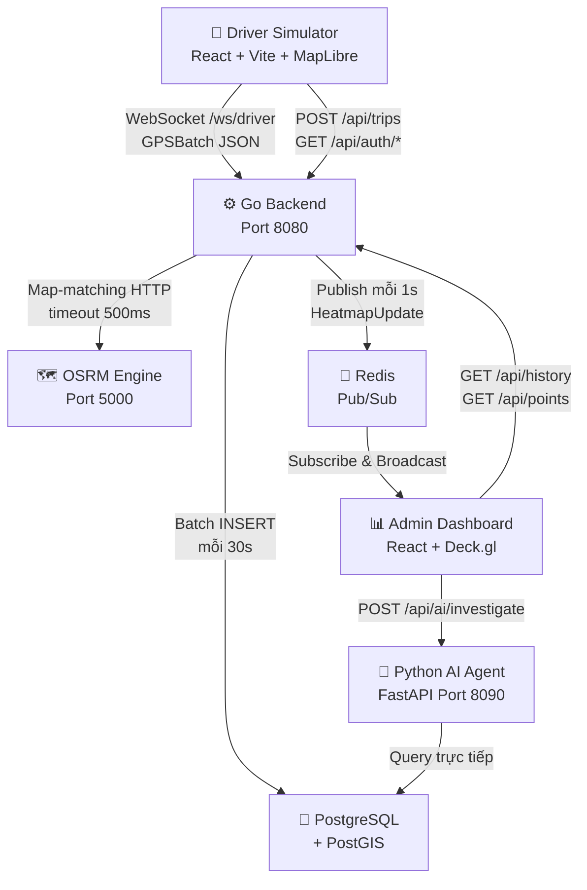
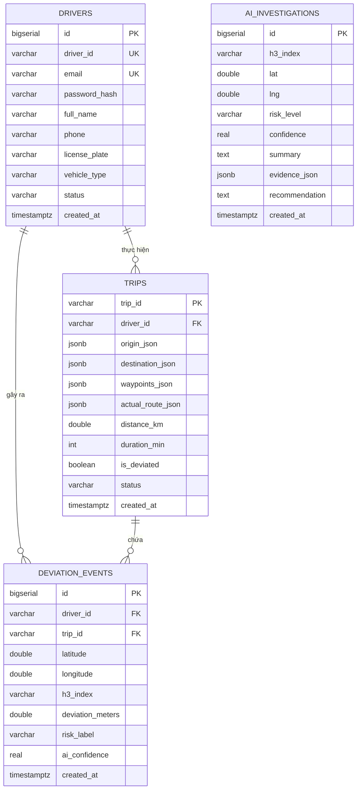

# Đặc Tả Yêu Cầu Phần Mềm (SRS)
## Heat Map Pro — Hệ Thống Heatmap Theo Dõi Độ Lệch Tài Xế Thời Gian Thực

| Thông tin | Chi tiết |
|---|---|
| **Phiên bản** | 1.0.0 |
| **Ngày tạo** | 10/08/2026 |
| **Trạng thái** | Chính thức |

---

## Mục Lục

1. [Giới Thiệu](#1-giới-thiệu)
2. [Tổng Quan Hệ Thống](#2-tổng-quan-hệ-thống)
3. [Các Vai Trò & Người Dùng](#3-các-vai-trò--người-dùng)
4. [Yêu Cầu Chức Năng](#4-yêu-cầu-chức-năng)
5. [Yêu Cầu Phi Chức Năng](#5-yêu-cầu-phi-chức-năng)
6. [Ràng Buộc Hệ Thống](#6-ràng-buộc-hệ-thống)
7. [Mô Hình Dữ Liệu](#7-mô-hình-dữ-liệu)
8. [Giao Diện Ngoài](#8-giao-diện-ngoài)

---

## 1. Giới Thiệu

### 1.1 Mục Đích Tài Liệu

Tài liệu này định nghĩa toàn bộ yêu cầu chức năng và phi chức năng của hệ thống **Heat Map Pro** — một nền tảng phân tích địa không gian thời gian thực, được thiết kế để theo dõi, trực quan hóa và điều tra các mẫu lệch lộ trình của tài xế taxi/ride-hailing tại Việt Nam.

### 1.2 Phạm Vi Hệ Thống

Hệ thống nhận dữ liệu GPS từ các tài xế mô phỏng, phát hiện độ lệch khỏi lộ trình đã lên kế hoạch bằng thuật toán map-matching, tổng hợp dữ liệu không gian theo lưới lục giác H3 của Uber, và hiển thị kết quả trên Admin Dashboard. Một AI Agent tự động điều tra nguyên nhân gây ra các điểm nóng lệch lộ trình từ nhiều nguồn dữ liệu.

### 1.3 Thuật Ngữ & Định Nghĩa

| Thuật Ngữ | Định Nghĩa |
|---|---|
| **Sự kiện lệch lộ trình** | Một điểm GPS được xác nhận lệch ≥ 50m so với lộ trình đường bộ đã lên kế hoạch |
| **Ô H3 (H3 Cell / Grid Cell)** | Ô lưới địa lý dùng để nhóm các điểm GPS lệch. **Backend** dùng grid thuần Go mô phỏng H3 Resolution 8 (~460m × 460m). **Frontend** dùng thư viện `h3-js` thật ở Resolution 11 (~25m) để xử lý waypoint. Index backend có format `H8:latGrid:lngGrid`. |
| **OSRM** | Open Source Routing Machine — Engine C++ để map-matching và tính lộ trình trên bản đồ đường bộ |
| **Bounding Box (BBox)** | Hình chữ nhật địa lý bao quanh lộ trình dự kiến của chuyến đi (có buffer 50m) |
| **Heatmap** | Lớp trực quan hóa trên bản đồ, tô màu các ô lưới theo mức độ lệch lộ trình |
| **Chuyến đi (Trip)** | Một hành trình lái xe với điểm xuất phát, điểm đến và lộ trình đã lên kế hoạch |
| **Driver ID** | Chuỗi định danh duy nhất của tài xế (VD: `DRV-17F56574`, `taxi-20000455`) |
| **ReAct Engine** | Mẫu AI Reason-Act (Lý luận - Hành động) dùng trong Python AI Agent |

---

## 2. Tổng Quan Hệ Thống

### 2.1 Ngữ Cảnh Hệ Thống

### 2.2 Các Hệ Thống Con

| Hệ Thống Con | Công Nghệ | Vai Trò |
|---|---|---|
| **Driver Simulator** | React 18 + Vite + MapLibre + `h3-js` | Giao diện mô phỏng GPS, routing, dedup waypoint bằng H3 res.11 |
| **Go Backend** | Go 1.22+, Gorilla WebSocket | Nhận GPS, lọc, tổng hợp (grid indexer thuần Go), REST API |
| **OSRM Engine** | C++ Docker container | Map-matching để phát hiện độ lệch, tính lộ trình tối ưu |
| **Redis** | Redis 7 Alpine | Pub/Sub thời gian thực cho broadcast |
| **PostgreSQL + PostGIS** | PostgreSQL 16 + PostGIS 3.4 | Lưu trữ lịch sử sự kiện lệch lộ trình |
| **Admin Dashboard** | React 18 + Vite + Deck.gl + MapLibre + `h3-js` | Trực quan hóa heatmap và phân tích lộ trình |
| **AI Agent** | Python FastAPI + Groq/Gemini LLM | Điều tra ngữ cảnh tự động các điểm nóng |
| **Nginx** | Nginx Alpine | Reverse proxy, điểm vào duy nhất |

---

## 3. Các Vai Trò & Người Dùng

### 3.1 Định Nghĩa Vai Trò

| Vai Trò | Mô Tả |
|---|---|
| **Quản Trị Viên** | Sử dụng Admin Dashboard để theo dõi độ lệch tài xế theo thời gian thực và lịch sử |
| **Tài Xế** | Sử dụng Driver Simulator để đăng nhập, lên kế hoạch lộ trình, vẽ lộ trình thực tế và nộp chuyến đi |
| **Hệ Thống** | Go Backend tự động xử lý dữ liệu GPS và phát broadcast cập nhật |
| **AI Agent** | Dịch vụ Python tự động điều tra các điểm nóng khi được yêu cầu |

### 3.2 User Stories — Tài Xế

| Mã | Câu Chuyện Người Dùng |
|---|---|
| **US-D1** | Là một Tài xế, tôi muốn **đăng ký và đăng nhập** tài khoản để lịch sử chuyến đi được lưu trữ an toàn theo danh tính riêng. |
| **US-D2** | Là một Tài xế, tôi muốn **lên kế hoạch lộ trình** giữa điểm đi và điểm đến bằng OSRM để thấy con đường tối ưu. |
| **US-D3** | Là một Tài xế, tôi muốn **vẽ lộ trình thực tế** trên bản đồ (chế độ vẽ) để mô phỏng một con đường bị lệch. |
| **US-D4** | Là một Tài xế, tôi muốn **căn chỉnh lộ trình đã vẽ** về đường thực tế qua OSRM Match API để tọa độ GPS chính xác. |
| **US-D5** | Là một Tài xế, tôi muốn **nộp chuyến đi** lên backend để dữ liệu GPS được nhận và chuyến đi được lưu lại. |
| **US-D6** | Là một Tài xế, tôi muốn **xem lại các chuyến đi cũ** trên bản đồ để kiểm tra lịch sử lộ trình. |

### 3.3 User Stories — Quản Trị Viên

| Mã | Câu Chuyện Người Dùng |
|---|---|
| **US-A1** | Là một Quản trị viên, tôi muốn thấy **heatmap lục giác H3 cập nhật mỗi giây** để theo dõi điểm nóng theo thời gian thực. |
| **US-A2** | Là một Quản trị viên, tôi muốn **chuyển sang Chế Độ Lịch Sử** và truy vấn dữ liệu theo khoảng thời gian để phân tích hồi cứu. |
| **US-A3** | Là một Quản trị viên, tôi muốn **lọc heatmap theo Driver ID** cụ thể để kiểm tra mẫu lệch lộ trình của từng tài xế. |
| **US-A4** | Là một Quản trị viên, tôi muốn **nhấp vào một chuyến đi** và thấy lộ trình kế hoạch vs. lộ trình thực tế trên bản đồ. |
| **US-A5** | Là một Quản trị viên, tôi muốn **nhấp vào ô heatmap để điều tra AI** và nhận chẩn đoán ngữ cảnh về nguyên nhân lệch lộ trình. |
| **US-A6** | Là một Quản trị viên, tôi muốn xem **biểu đồ phân tích 24 giờ** để xác định khung giờ lệch lộ trình nhiều nhất. |

---

## 4. Yêu Cầu Chức Năng

### 4.1 Phần Mềm Mô Phỏng Tài Xế (FR-SIM)

| ID | Yêu Cầu |
|---|---|
| **FR-SIM-01** | Hệ thống PHẢI cung cấp luồng xác thực tài xế (Đăng ký / Đăng nhập / Đăng xuất) thông qua REST endpoint `/api/auth/*`. |
| **FR-SIM-02** | Hệ thống PHẢI cho phép tài xế nhập điểm đi và điểm đến bằng cách gõ tên hoặc nhấp trên bản đồ. |
| **FR-SIM-03** | Hệ thống PHẢI lấy lộ trình kế hoạch từ OSRM và hiển thị dưới dạng đường polyline màu xanh trên bản đồ. |
| **FR-SIM-04** | Hệ thống PHẢI hỗ trợ **Chế Độ Vẽ** cho phép tài xế nhấp bản đồ để thêm điểm tạo thành lộ trình thực tế (có thể lệch). |
| **FR-SIM-05** | Hệ thống PHẢI căn chỉnh các điểm đã vẽ về đường bộ gần nhất thông qua OSRM Map Match API. |
| **FR-SIM-06** | Hệ thống PHẢI tạo ID chuyến đi duy nhất dạng `TRIP-XXXXXXX` và nộp lên backend qua `POST /api/trips`. |
| **FR-SIM-07** | Hệ thống PHẢI gửi tọa độ GPS dưới dạng `GPSBatch` JSON qua kết nối WebSocket tới `/ws/driver`. |
| **FR-SIM-08** | Hệ thống PHẢI hiển thị danh sách chuyến đi lịch sử của tài xế và cho phép tải lại chúng trong **Chế Độ Xem Lại**. |
| **FR-SIM-09** | Hệ thống PHẢI hiển thị chỉ báo trạng thái kết nối WebSocket theo thời gian thực. |

### 4.2 Đường Ống Nhận GPS (FR-ING)

| ID | Yêu Cầu |
|---|---|
| **FR-ING-01** | Backend PHẢI chấp nhận kết nối WebSocket tại `/ws/driver` và xử lý tin nhắn `GPSBatch` (định dạng JSON). |
| **FR-ING-02** | Backend PHẢI giải mã từng `GPSBatch` và xử lý từng `GPSPoint` qua đường ống phát hiện lệch lộ trình. |
| **FR-ING-03** | Backend PHẢI thực hiện **kiểm tra Bounding Box** trước: nếu điểm GPS nằm trong BBox của chuyến đi (+ buffer 50m), nó PHẢI bị loại bỏ. |
| **FR-ING-04** | Với các điểm nằm ngoài BBox, backend PHẢI gọi **OSRM Map Match API** (timeout 500ms) để tính khoảng cách lệch. |
| **FR-ING-05** | Nếu khoảng cách lệch qua OSRM ≤ 50m, điểm PHẢI được phân loại là nhiễu GPS và bị loại bỏ. |
| **FR-ING-06** | Với lệch lộ trình đã xác nhận (> 50m), backend PHẢI chuyển đổi tọa độ GPS sang **chỉ số ô lưới** dùng grid-based indexer thuần Go (mô phỏng H3 Resolution 8, ~460m/ô). Format index: `H8:latGrid:lngGrid`. |
| **FR-ING-07** | Backend PHẢI tăng bộ đếm lệch trong bộ nhớ cho ô lưới tương ứng bằng `sync.Map` + `atomic.AddUint64`. |
| **FR-ING-08** | Backend PHẢI đệm chi tiết sự kiện lệch để ghi batch vào PostgreSQL mỗi **30 giây**. |
| **FR-ING-09** | Backend PHẢI theo dõi Driver ID đang hoạt động trong bộ nhớ để báo cáo số tài xế đang hoạt động. |

### 4.3 Phát Sóng Thời Gian Thực (FR-RT)

| ID | Yêu Cầu |
|---|---|
| **FR-RT-01** | Redis Publisher PHẢI đẩy bộ đếm H3 từ bộ nhớ lên kênh Redis `heatmap:updates` mỗi **1 giây**. |
| **FR-RT-02** | Tin nhắn publish PHẢI chứa: các ô H3 đã cập nhật (delta), timestamp server, tổng tài xế đang hoạt động, tổng sự kiện lệch. |
| **FR-RT-03** | Admin WebSocket Hub PHẢI đăng ký (subscribe) kênh Redis và broadcast tin nhắn tới tất cả client Admin đang kết nối. |
| **FR-RT-04** | Admin client kết nối qua WebSocket tại `/ws/admin` để nhận các tin nhắn `HeatmapUpdate`. |

### 4.4 Admin Dashboard (FR-ADMIN)

| ID | Yêu Cầu |
|---|---|
| **FR-VIS-01** | Admin Dashboard PHẢI hiển thị 3D H3 Hexagon Layer lên bản đồ với màu sắc thể hiện mức độ lệch (gradient xanh lá → vàng → đỏ), chiều cao (độ ép cột) theo số lượt tránh. |
| **FR-VIS-02** | Resolution của 3D H3 Hexagon Layer PHẢI **tự điều chỉnh theo zoom level** bản đồ theo bảng sau: |
| | **Zoom Level** | **H3 Resolution** | **Kích thước ô** | **Mức dùng** |
| | < 10 | 9 | ~174m | Toàn thành phố |
| | 10 – 11 | 10 | ~66m | Quận / khu vực |
| | 12 – 13 | 11 | ~25m | Đường phố |
| | 14 – 15 | 12 | ~9m | Ngã tư |
| | 16 – 17 | 13 | ~3m | Làn xe |
| | ≥ 18 | 14 (MAX) | ~1m | Chi tiết nhất |
| **FR-VIS-03** | Resolution KHÔNG được thay đổi liên tục trên từng frame zoom. PHẢI debounce tối thiểu **300ms** và chỉ re-compute khi zoom vượt ngưỡng tiếp theo (tối đa 6 lần re-compute cho toàn bộ dải zoom). |
| **FR-VIS-04** | Popup thông tin khi click vào ô hexagon PHẢI hiển thị đúng resolution và kích thước ô tương ứng. |
| **FR-VIS-05** | Dashboard PHẢI hiển thị smooth 2D heatmap gradient song song với 3D H3 Layer (có thể tắt bật riêng). |
| **FR-ADMIN-01** | Dashboard PHẢI hiển thị bản đồ nền MapLibre GL JS, không cần API key, dark theme. |
| **FR-ADMIN-03** | Ở **Chế Độ Live**, dashboard PHẢI tiêu thụ luồng WebSocket và cập nhật liên tục lớp heatmap H3 trong thời gian thực. |
| **FR-ADMIN-04** | Ở **Chế Độ Lịch Sử**, dashboard PHẢI lấy dữ liệu từ `GET /api/history?from=<ms>&to=<ms>`. |
| **FR-ADMIN-05** | Dashboard PHẢI hỗ trợ bộ lọc **Khoảng Thời Gian** (From / To datetime picker) ở chế độ Lịch Sử. |
| **FR-ADMIN-06** | Dashboard PHẢI hỗ trợ bộ lọc **Tài Xế** (dropdown có tìm kiếm) để lọc dữ liệu theo từng tài xế. |
| **FR-ADMIN-07** | Khi chọn tài xế, dashboard PHẢI tự động chuyển sang Chế Độ Lịch Sử và tải lại dữ liệu có tham số `driver_id`. |
| **FR-ADMIN-08** | Dashboard PHẢI hiển thị danh sách chuyến đi (tab Trips) với thông tin tài xế, thời gian, và cờ lệch lộ trình. |
| **FR-ADMIN-09** | Nhấp vào chuyến đi PHẢI hiển thị lộ trình kế hoạch (xanh) và lộ trình GPS thực tế (cam) dưới dạng polyline. |
| **FR-ADMIN-10** | Nhấp vào ô H3 PHẢI mở panel **Điều Tra AI**, gọi `POST /api/ai/investigate`. |
| **FR-ADMIN-11** | Dashboard PHẢI hiển thị **Biểu Đồ Phân Tích 24 Giờ** cho từng giờ trong ngày. |
| **FR-ADMIN-12** | Dashboard PHẢI hiển thị overlay thống kê thời gian thực: tổng sự kiện, tài xế đang hoạt động, trạng thái kết nối. |

### 4.5 REST API (FR-API)

| ID | Endpoint | Phương Thức | Mô Tả |
|---|---|---|---|
| **FR-API-01** | `/api/health` | GET | Trạng thái server, uptime và số tài xế đang hoạt động |
| **FR-API-02** | `/api/auth/register` | POST | Đăng ký tài khoản tài xế mới |
| **FR-API-03** | `/api/auth/login` | POST | Xác thực tài xế, trả về auth session token |
| **FR-API-04** | `/api/auth/me` | GET | Hồ sơ tài xế đã xác thực (yêu cầu Authorization Bearer token hoặc query driver_id) |
| **FR-API-05** | `/api/trips` | POST | Lưu chuyến đi mới vào PostgreSQL và broadcast sự kiện |
| **FR-API-06** | `/api/trips` | GET | Danh sách chuyến đi, lọc theo `driver_id` và `limit` |
| **FR-API-07** | `/api/history` | GET | Dữ liệu heatmap H3 tổng hợp, lọc theo thời gian và `driver_id` |
| **FR-API-08** | `/api/points` | GET | Điểm GPS lệch thô để hiển thị scatter, lọc theo thời gian và `driver_id` |
| **FR-API-09** | `/api/trajectories` | GET | Lộ trình GPS từng chuyến đi dưới dạng GeoJSON LineStrings |
| **FR-API-10** | `/api/deviations` | GET | Các bản ghi sự kiện lệch lộ trình riêng lẻ |
| **FR-API-11** | `/api/road-stats` | GET | Thống kê đoạn đường (dùng trong popup khi nhấp bản đồ) |
| **FR-API-12** | `/api/hourly-stats` | GET | Thống kê lệch lộ trình và số tài xế theo 24 giờ |
| **FR-API-13** | `/api/ai/investigate` | POST | Ủy quyền điều tra tới Python AI Agent |
| **FR-API-14** | `/api/actual-path` | GET | Dữ liệu ô H3 tổng hợp từ lộ trình thực tế tài xế đi khi bẻ lái (phục vụ lớp "Hex Tài Xế Đi") |

### 4.6 AI Agent (FR-AI)

| ID | Yêu Cầu |
|---|---|
| **FR-AI-01** | AI Agent PHẢI cung cấp endpoint `POST /investigate` nhận chỉ số ô H3, tọa độ, Driver ID và cửa sổ thời gian. |
| **FR-AI-02** | AI Agent PHẢI đồng thời thực thi: Weather API, Reverse Geocode, DB Telemetry (làm mịn Bayes & Wilson 95% CI), Driver Profile theo mẫu **ReAct**. |
| **FR-AI-03** | AI Agent PHẢI chạy công cụ thứ cấp (OSRM Alternatives, Traffic Speed) dựa trên kết quả công cụ sơ cấp. |
| **FR-AI-04** | AI Agent PHẢI kích hoạt **tìm kiếm tin tức/sự cố** nếu phát hiện nhiều chuyến đi lệch cao, tắc nghẽn nghiêm trọng hoặc mưa lớn. |
| **FR-AI-05** | AI Agent PHẢI gọi LLM (Groq LLaMA 3.3 70B hoặc Gemini 2.5 Flash, hoặc Rule-based fallback) với toàn bộ bằng chứng thu thập để tạo chẩn đoán có căn cứ. |
| **FR-AI-06** | AI Agent PHẢI trả về `DiagnosisResult` gồm: mức rủi ro (`SAFE_FORCE_MAJEURE`, `SUSPICIOUS`, `FRAUD_ALERT`), điểm tin cậy, tóm tắt, bằng chứng JSON, khuyến nghị. |
| **FR-AI-07** | Kết quả điều tra PHẢI được lưu vào bảng `ai_investigations` trong PostgreSQL. |

---

## 5. Yêu Cầu Phi Chức Năng

### 5.1 Hiệu Năng

| ID | Yêu Cầu |
|---|---|
| **NFR-P-01** | Go backend PHẢI dùng < **50 MB RAM** dưới tải bình thường với 500 tài xế đồng thời. |
| **NFR-P-02** | Tin nhắn WebSocket Simulator → Backend PHẢI < **1 KB** mỗi batch GPS. |
| **NFR-P-03** | Tin nhắn cập nhật heatmap Backend → Admin PHẢI < **10 KB** mỗi chu kỳ cập nhật. |
| **NFR-P-04** | Lời gọi OSRM Map Match API PHẢI hết hạn sau **500ms** để không chặn đường ống xử lý. |
| **NFR-P-05** | Chu kỳ flush Redis: **1.000 ms** (1 giây) cho cập nhật thời gian thực. |
| **NFR-P-06** | Chu kỳ ghi batch PostgreSQL: **30 giây** để đảm bảo hiệu quả persistence. |
| **NFR-P-07** | Kiểm tra Bounding Box PHẢI là thao tác **O(1)** trong bộ nhớ, không gọi OSRM. |
| **NFR-P-08** | Chuyển đổi tọa độ GPS sang index ô lưới PHẢI là thao tác **O(1)** không dùng CGO (thuần Go). |

### 5.2 Độ Tin Cậy

| ID | Yêu Cầu |
|---|---|
| **NFR-R-01** | Go backend PHẢI tắt graceful khi nhận `SIGINT`/`SIGTERM`, hoàn thành write đang thực thi trong **10 giây**. |
| **NFR-R-02** | Hook WebSocket của Admin PHẢI triển khai reconnection với **exponential-backoff** khi mất kết nối. |
| **NFR-R-03** | Tất cả dịch vụ Docker PHẢI định nghĩa chính sách `restart: unless-stopped`. |
| **NFR-R-04** | PostgreSQL và Redis PHẢI định nghĩa Docker healthcheck; backend PHẢI chờ cả hai healthy trước khi khởi động. |

### 5.3 Khả Năng Mở Rộng

| ID | Yêu Cầu |
|---|---|
| **NFR-S-01** | Aggregator PHẢI sử dụng `sync.Map` + atomic trong hot path — **KHÔNG dùng** `sync.Mutex`. |
| **NFR-S-02** | Hệ thống PHẢI hỗ trợ nhiều admin WebSocket client đồng thời thông qua Hub pattern. |
| **NFR-S-03** | Database index PHẢI được định nghĩa cho các mẫu truy vấn phổ biến: `created_at`, `h3_index`, `driver_id`, composite `(driver_id, created_at)`. |

### 5.4 Bảo Mật

| ID | Yêu Cầu |
|---|---|
| **NFR-SEC-01** | Xác thực tài xế PHẢI sử dụng mật khẩu được băm bằng **bcrypt**. |
| **NFR-SEC-02** | Tất cả thông tin xác thực và bí mật PHẢI được nạp từ **biến môi trường** — KHÔNG bao giờ hardcode trong source code. |
| **NFR-SEC-03** | Dữ liệu bản đồ OSRM (`*.osm.pbf`) PHẢI KHÔNG được commit vào Git. |

### 5.5 Khả Năng Bảo Trì

| ID | Yêu Cầu |
|---|---|
| **NFR-M-01** | Go backend PHẢI sử dụng **structured logging** (`log/slog`) cho tất cả log message. |
| **NFR-M-02** | Mỗi file `.go` PHẢI có file `_test.go` tương ứng với các bài test dạng **table-driven**. |
| **NFR-M-03** | Schema Protobuf (`proto/heatmap/v1/messages.proto`) là **nguồn chân lý duy nhất** — code sinh ra trong `backend/gen/` KHÔNG ĐƯỢC chỉnh sửa thủ công. |
| **NFR-M-04** | Tất cả biến môi trường PHẢI được ghi chú đầy đủ trong `.env.example`. |

---

## 6. Ràng Buộc Hệ Thống

| Ràng Buộc | Mô Tả |
|---|---|
| **Phần Cứng** | Thiết kế cho VPS 4GB với giới hạn resource Docker từng dịch vụ (xem SDD mục 9). |
| **Dữ Liệu Bản Đồ** | OSRM cần file `.osrm` đã tiền xử lý. Hệ thống hỗ trợ bản đồ Việt Nam hoặc Porto, Bồ Đào Nha. |
| **API Key LLM** | AI Agent cần `GROQ_API_KEY` hoặc `GEMINI_API_KEY` để thực hiện điều tra bằng LLM. |
| **Phiên Bản Go** | Go 1.22 trở lên là bắt buộc cho backend. |
| **Trình Duyệt** | Yêu cầu trình duyệt hiện đại có hỗ trợ WebSocket và WebGL (cho MapLibre + Deck.gl). |
| **Windows** | Trên Windows, dùng `go build -o server.exe` thay vì `go run` do chính sách AppLocker. |

---

## 7. Mô Hình Dữ Liệu

### 7.1 Sơ Đồ Quan Hệ Thực Thể (ERD)

### 7.2 Chi Tiết Các Bảng

#### Bảng `deviation_events` — Kho Dữ Liệu Chính

| Cột | Kiểu Dữ Liệu | Mô Tả |
|---|---|---|
| `id` | BIGSERIAL PK | Khóa chính tự tăng |
| `driver_id` | VARCHAR(64) NOT NULL | Mã định danh tài xế |
| `trip_id` | VARCHAR(128) NOT NULL | Mã định danh chuyến đi |
| `latitude` | DOUBLE PRECISION NOT NULL | Vĩ độ GPS (WGS84) |
| `longitude` | DOUBLE PRECISION NOT NULL | Kinh độ GPS (WGS84) |
| `h3_index` | VARCHAR(20) NOT NULL | Chỉ số ô H3 (Resolution 8) |
| `deviation_meters` | DOUBLE PRECISION NOT NULL | Khoảng cách lệch khỏi lộ trình (mét) |
| `heading` | REAL DEFAULT 0 | Hướng di chuyển của xe (0–360°) |
| `speed_kmh` | REAL DEFAULT 0 | Tốc độ xe (km/h) |
| `risk_label` | VARCHAR(30) DEFAULT 'unclassified' | Phân loại rủi ro do AI gán |
| `ai_confidence` | REAL DEFAULT 0 | Điểm tin cậy AI (0.0–1.0) |
| `event_type` | VARCHAR(20) DEFAULT 'deviation' | Loại sự kiện: `'deviation'` (điểm lệch khỏi lộ trình) hoặc `'actual_path'` (đoạn đường thực tế tài xế đã đi) |
| `geog` | GEOGRAPHY(Point, 4326) | Đối tượng địa lý PostGIS hỗ trợ truy vấn không gian nhanh bằng GIST index |
| `created_at` | TIMESTAMPTZ NOT NULL DEFAULT NOW() | Thời điểm xảy ra sự kiện lệch |

#### Bảng `trips` — Đăng Ký Chuyến Đi

| Cột | Kiểu Dữ Liệu | Mô Tả |
|---|---|---|
| `trip_id` | VARCHAR(128) PK | Mã chuyến đi duy nhất (VD: `TRIP-ABC1234`) |
| `driver_id` | VARCHAR(64) NOT NULL | Mã tài xế |
| `bbox_*` | DOUBLE PRECISION | Bounding box 4 góc của lộ trình kế hoạch |
| `origin_json` | JSONB | Điểm xuất phát `{lat, lng, label}` |
| `destination_json` | JSONB | Điểm đến `{lat, lng, label}` |
| `waypoints_json` | JSONB | Mảng tọa độ lộ trình kế hoạch |
| `actual_route_json` | JSONB | Mảng tọa độ lộ trình GPS thực tế |
| `planned_route_json` | JSONB | Mảng tọa độ lộ trình gợi ý chuẩn từ OSRM |
| `distance_km` | DOUBLE PRECISION | Tổng khoảng cách lộ trình (km) |
| `duration_min` | INTEGER | Thời gian chuyến đi ước tính (phút) |
| `is_deviated` | BOOLEAN | Tài xế có lệch khỏi kế hoạch không |
| `deviation_ratio` | REAL DEFAULT 0.0 | Tỷ lệ phần trăm quãng đường thực tế bị lệch khỏi lộ trình chuẩn (0.0 - 1.0) |
| `status` | VARCHAR(20) DEFAULT 'active' | Trạng thái chuyến đi |

#### Bảng `drivers` — Tài Khoản Tài Xế

| Cột | Kiểu Dữ Liệu | Mô Tả |
|---|---|---|
| `driver_id` | VARCHAR(64) UNIQUE NOT NULL | Chuỗi định danh tài xế duy nhất |
| `email` | VARCHAR(128) UNIQUE NOT NULL | Email đăng nhập |
| `password_hash` | VARCHAR(255) NOT NULL | Mật khẩu đã băm (bcrypt) |
| `full_name` | VARCHAR(128) NOT NULL | Họ tên đầy đủ |
| `phone` | VARCHAR(32) | Số điện thoại |
| `license_plate` | VARCHAR(32) | Biển số xe |
| `vehicle_type` | VARCHAR(32) DEFAULT 'taxi' | Loại phương tiện |

#### Bảng `ai_investigations` — Nhật Ký Điều Tra AI

| Cột | Kiểu Dữ Liệu | Mô Tả |
|---|---|---|
| `h3_index` | VARCHAR(20) NOT NULL | Ô H3 được điều tra |
| `risk_level` | VARCHAR(30) NOT NULL | Mức độ rủi ro do AI gán |
| `confidence` | REAL NOT NULL | Điểm tin cậy của LLM |
| `summary` | TEXT NOT NULL | Chẩn đoán văn bản do AI tạo ra |
| `evidence_json` | JSONB | Gói bằng chứng thô (thời tiết, tin tức, telemetry...) |
| `recommendation` | TEXT | Khuyến nghị hành động |
| `location_name` | VARCHAR(256) | Tên địa điểm từ reverse geocoding |

---

## 8. Giao Diện Ngoài

### 8.1 OSRM HTTP API

| Endpoint | Mô Tả | Timeout |
|---|---|---|
| `GET /route/v1/driving/{coords}` | Tính lộ trình tối ưu giữa hai điểm | 500ms |
| `GET /match/v1/driving/{coords}` | Căn chỉnh tọa độ GPS về đường bộ gần nhất | 500ms |
| `GET /nearest/v1/driving/{lng},{lat}` | Tìm điểm đường bộ gần nhất | 500ms |

### 8.2 Công Cụ AI Agent

| Công Cụ | Nguồn Dữ Liệu | Mô Tả |
|---|---|---|
| **Thời tiết** | Open-Meteo API (miễn phí) | Nhiệt độ, lượng mưa, gió theo thời gian thực |
| **Reverse Geocode** | Nominatim / OpenStreetMap | Chuyển tọa độ thành địa chỉ đọc được |
| **Tìm kiếm Tin Tức** | Tavily API | Tìm sự cố giao thông/tin tức khu vực |
| **DB Telemetry** | PostgreSQL nội bộ | Thống kê lệch lộ trình từ `deviation_events` |
| **Driver Profile** | PostgreSQL nội bộ | Lịch sử và hồ sơ danh tiếng của tài xế |
| **OSRM Alternatives** | OSRM Route API | Phân tích các lộ trình thay thế |
| **Traffic Speed** | Tổng hợp telemetry H3 | So sánh tốc độ tài xế với tốc độ điển hình |

### 8.3 LLM API

| Provider | Biến Môi Trường | Vai Trò |
|---|---|---|
| **Groq API** | `GROQ_API_KEY` | LLM chính (ưu tiên) |
| **Gemini API** | `GEMINI_API_KEY` | LLM dự phòng |
